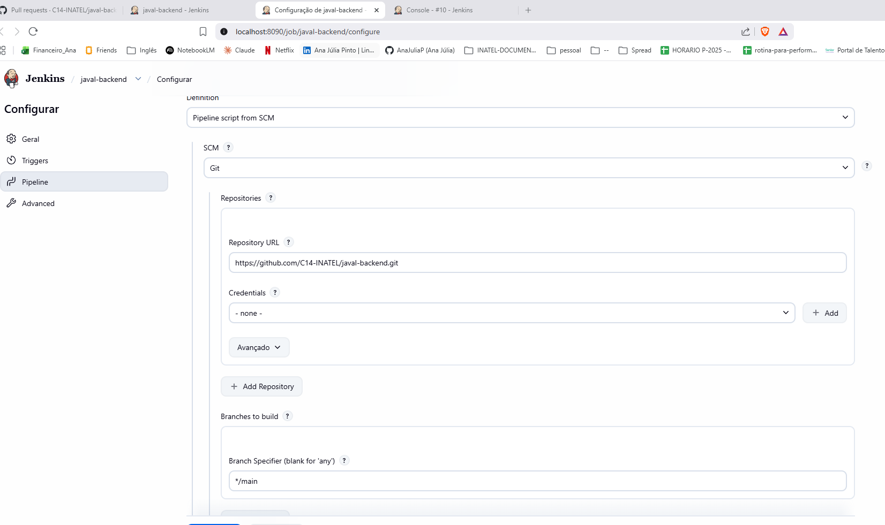
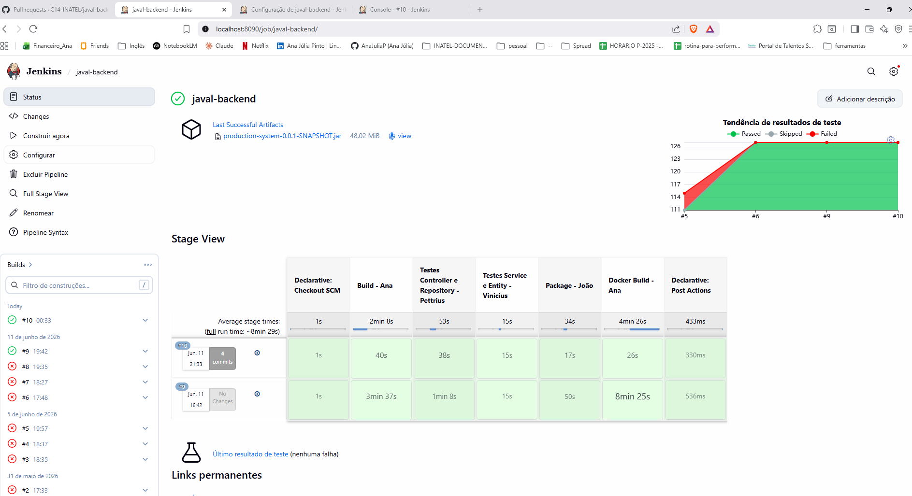
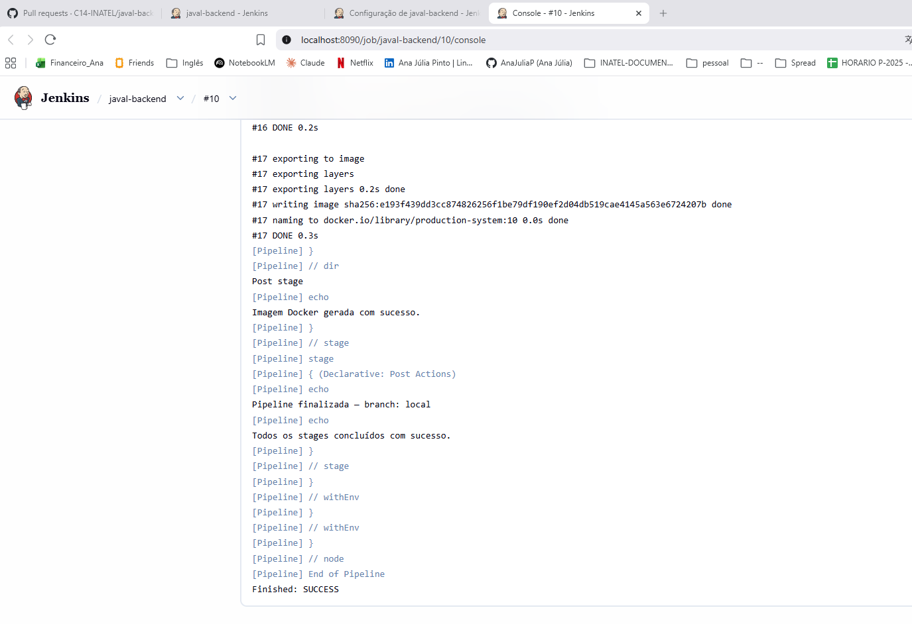
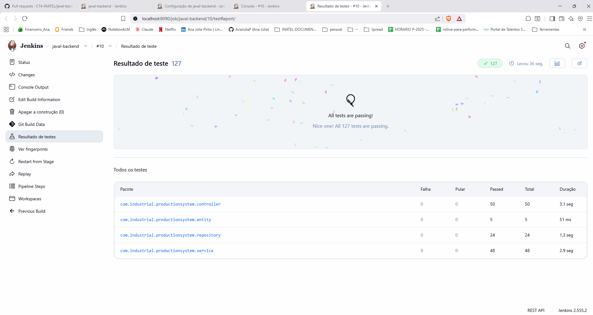

# CI/CD — Pipeline Jenkins

Este documento apresenta a configuração e as evidências de execução da pipeline de CI/CD do projeto JAVAL Backend.

## Ferramenta utilizada

A pipeline foi implementada com **Jenkins**, rodando localmente via Docker.

## O que a pipeline executa

| Etapa | Responsável | Descrição |
|-------|-------------|-----------|
| Build | Ana | Compilação do projeto com Maven (`mvn clean compile`) |
| Testes Controller e Repository | Pettrius | Execução dos testes de integração (`*ControllerTest`, `*RepositoryTest`) com banco H2 |
| Testes Service e Entity | Vinicius | Execução dos testes unitários (`*ServiceTest`, entidades) com banco H2 |
| Package | João | Geração do `.jar` e arquivamento como artefato no Jenkins |
| Docker Build | Ana | Build da imagem Docker da aplicação |

Cada etapa publica relatórios de teste via plugin JUnit e exibe mensagens de status (sucesso/falha) ao final da execução.

## Configuração

- Repositório: `https://github.com/C14-INATEL/javal-backend.git`
- Branch: `main`
- Script Path: `Jenkinsfile`
- JDK configurado: `JDK21`
- Profile de testes: `spring.profiles.active=test` (utiliza banco H2 em memória, sem dependência externa)

## Como reproduzir localmente

1. Subir o Jenkins via Docker:
   ```bash
   docker compose -f docker-compose.jenkins.yml up -d
   ```
2. Acessar `http://localhost:8090`
3. Criar um item do tipo **Pipeline**
4. Em **Pipeline script from SCM**, configurar o repositório e branch acima
5. Executar **Build Now**

## Evidências de execução

### Configuração da pipeline (SCM)

A pipeline está configurada para puxar o código diretamente do repositório `C14-INATEL/javal-backend`, branch `main`, lendo o `Jenkinsfile` versionado no projeto.



### Stage View — todos os stages concluídos com sucesso

Build #10 — todos os stages (Build, Testes Controller/Repository, Testes Service/Entity, Package e Docker Build) finalizados com sucesso, com tendência de testes mostrando 100% de aprovação nas últimas execuções.



### Console Output — finalização da pipeline

Log final da execução mostrando a geração da imagem Docker e o status `Finished: SUCCESS`.



### Resultado dos testes — 127/127 aprovados

Relatório consolidado por pacote (controller, entity, repository, service), gerado automaticamente pelo plugin JUnit a partir dos relatórios de surefire.

